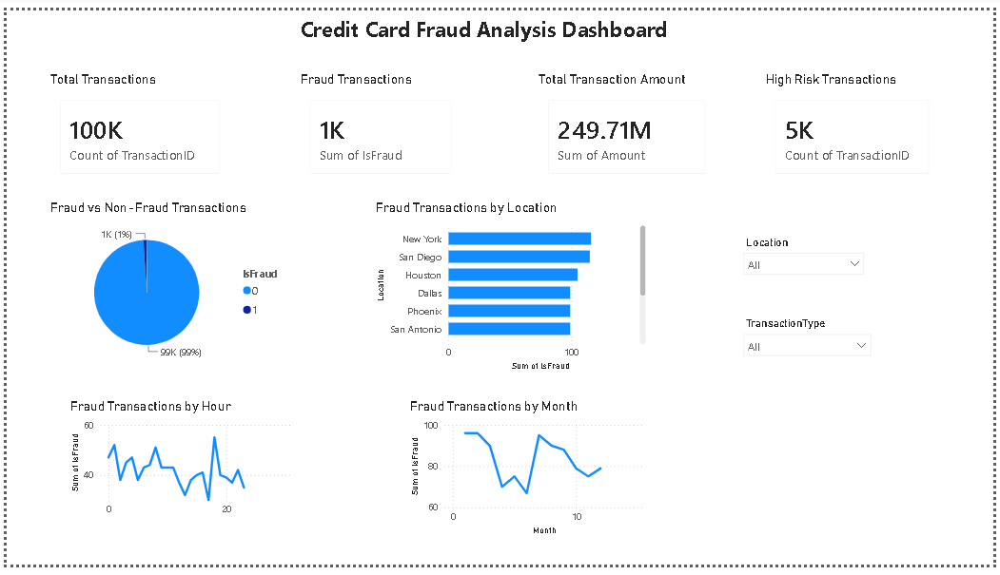

# Credit Card Transaction Fraud Analysis

## Overview

This project analyzes 100,000 credit card transactions to identify fraudulent activities, high-risk transactions, and behavioral patterns. The workflow combines data preprocessing in Python, analytical querying in MySQL, and interactive dashboard development in Power BI to support fraud monitoring and investigation.

The project demonstrates an end-to-end data analytics pipeline, covering data cleaning, feature engineering, SQL analysis, and business intelligence reporting.

---

## Tech Stack

* Python (Pandas)
* MySQL
* Power BI

---

## Dataset

The dataset contains 100,000 credit card transactions with the following attributes:

| Column          | Description                       |
| --------------- | --------------------------------- |
| TransactionID   | Unique transaction identifier     |
| Amount          | Transaction amount                |
| TransactionDate | Date of transaction               |
| Location        | Transaction location              |
| MerchantID      | Merchant identifier               |
| TransactionType | Purchase or Refund                |
| IsFraud         | Fraud indicator (0 = No, 1 = Yes) |
| RiskFlag        | Risk category                     |
| Hour            | Transaction hour                  |
| Day             | Transaction day                   |
| Month           | Transaction month                 |
| Year            | Transaction year                  |

---

## Project Workflow

### 1. Data Preprocessing (Python)

* Loaded raw transaction data using Pandas
* Cleaned and validated records
* Created time-based features:

  * Hour
  * Day
  * Month
  * Year
* Generated RiskFlag categories
* Exported cleaned dataset for SQL analysis and Power BI reporting

---

### 2. SQL Analysis (MySQL)

Performed analytical queries to investigate:

* Total transactions
* Fraud transaction count
* Fraud rate percentage
* Fraud distribution by location
* Fraud distribution by hour
* Fraud distribution by month
* Fraud distribution by transaction type
* High-risk transaction analysis
* Average fraud transaction amount
* Merchant fraud analysis

Created a SQL view:

```sql
CREATE VIEW fraud_summary AS
SELECT
    TransactionID,
    Amount,
    Location,
    TransactionType,
    Hour,
    RiskFlag
FROM transactions
WHERE IsFraud = 1;
```

---

## Key Findings

### Transaction Summary

| Metric                 | Value   |
| ---------------------- | ------- |
| Total Transactions     | 100,000 |
| Fraud Transactions     | 1,000   |
| Fraud Rate             | 1.00%   |
| High Risk Transactions | 5,000   |

### Fraud by Location

Top locations with fraudulent activity:

* New York (116)
* San Diego (115)
* Houston (105)
* San Antonio (99)
* Dallas (99)

### Fraud by Transaction Type

| Type     | Fraud Count |
| -------- | ----------- |
| Purchase | 493         |
| Refund   | 507         |

### Fraud by Risk Category

| Risk Category | Fraud Count |
| ------------- | ----------- |
| Normal        | 946         |
| High Risk     | 54          |

---

## Power BI Dashboard

The dashboard provides interactive analysis of fraud patterns through:

### KPI Cards

* Total Transactions
* Fraud Transactions
* Total Transaction Amount
* High Risk Transactions

### Visualizations

* Fraud vs Non-Fraud Transactions
* Fraud Transactions by Location
* Fraud Transactions by Hour
* Fraud Transactions by Month

### Interactive Filters

* Location
* Transaction Type

---

## Dashboard Preview



---

## Project Structure

```text
credit-card-fraud-analysis/
│
├── Credit_Card_Fraud_Analysis.pbix
├── credit_card_fraud_cleaned.csv
├── credit_card_fraud_dashboard.png
├── sql_queries.sql
└── README.md
```

---

## Skills Demonstrated

* Data Cleaning
* Data Analysis
* Feature Engineering
* SQL Querying
* Database Management
* Business Intelligence
* Dashboard Development
* Data Visualization
* Fraud Analytics
* Power BI Reporting

---

## Author

Sherlien Molly D
